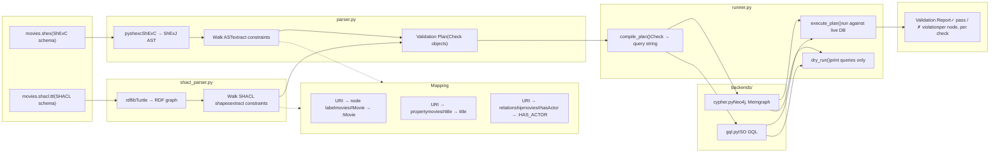

# graphlint

An ontology linter for labeled property graphs.

Define your graph schema in [ShExC](https://shex.io/shex-primer/) or [SHACL](https://www.w3.org/TR/shacl/). Validate it against any LPG database.

## How it works



1. **Write shapes in ShExC or SHACL** — human-readable, formally grounded schema languages
2. **Parser** compiles shapes into a vendor-neutral validation plan (list of `Check` objects)
3. **Mapping** converts RDF URIs to LPG names (labels, properties, relationship types) using conventions or explicit overrides
4. **Backends** translate each check into an executable query (Cypher or GQL)
5. **Runner** executes queries against your database; violations are collected into a report

## Quick start

```bash
uv run main.py
```

### main.py

```python
from graphlint.parser import parse_schema
from graphlint.backends.cypher import CypherBackend
from graphlint.runner import dry_run, execute_plan

# Parse a schema (auto-detects ShExC vs SHACL)
with open("examples/movies.shex") as f:
    schema = f.read()
# Or SHACL: open("examples/movies.shacl.ttl")

plan = parse_schema(schema, source="movies.shex")
# Or with strict mode for closed-world coverage checks:
# plan = parse_schema(schema, source="movies.shex", strict=True)

# Dry run — see the generated queries without a database
print(dry_run(plan, CypherBackend()))

# Or execute against a live Neo4j instance
from neo4j import GraphDatabase
driver = GraphDatabase.driver("neo4j://localhost:7687", auth=("neo4j", "password"))
report = execute_plan(plan, CypherBackend(), driver, target_uri="neo4j://localhost:7687")
print(report.print_table())
```

## Example schema (ShExC)

```shex
PREFIX ex: <http://example.org/movies#>
PREFIX xsd: <http://www.w3.org/2001/XMLSchema#>

ex:Movie {
    ex:title         xsd:string    ;
    ex:released      xsd:integer   ;
    ex:tagline       xsd:string ?  ;
    ex:hasActor      @ex:Person +  ;    # 1 or more
    ex:hasDirector   @ex:Person         # exactly 1
}

ex:Person {
    ex:name          xsd:string    ;
    ex:born          xsd:integer ? ;    # optional
}

ex:Genre {
    ex:name          xsd:string  ;
    ex:rating        ["G" "PG" "PG-13" "R" "NC-17"] ?  # enum values
}
```

This compiles into validation checks covering property existence,
type constraints, allowed values, and relationship cardinality.

## Strict mode

By default, graphlint only validates what your schema declares (open-world assumption). Enable **strict mode** to also check for things your schema _doesn't_ mention:

| Check | Severity | What it catches |
| ----- | -------- | --------------- |
| Undeclared labels | warning | Node labels in the database not declared as shapes |
| Undeclared relationship types | warning | Relationship types not referenced by any shape |
| Undeclared properties | warning | Properties on declared node types not mentioned in the schema |
| Empty shapes | warning | Shapes declared in the schema with zero matching nodes |

```python
plan = parse_schema(schema, source="movies.shex", strict=True)
```

In the playground, toggle the **strict** checkbox in the connection bar.

## Playground

Interactive web UI for testing schemas against a live database:

```bash
uv run python playground.py
# Open http://127.0.0.1:8420
```

Features:
- **Live editing** — ShExC / SHACL editor with auto-compile on keystroke
- **Database connection** — Connect to any Neo4j/Memgraph instance via Bolt
- **Strict mode toggle** — Enable closed-world coverage checks
- **Four output tabs:**
  - **Checks** — validation plan grouped by shape, color-coded by severity
  - **Cypher** — generated queries with syntax highlighting
  - **Results** — validation report with pass/fail/warning cards, violating node details, and vacuous check detection (skips checks when no data exists for a shape)
  - **JSON** — raw validation plan

## Backends

| Backend | Status  | Target databases            |
| ------- | ------- | --------------------------- |
| Cypher  | ✓       | Neo4j, Memgraph             |
| GQL     | ✓       | ISO GQL-compliant databases |
| Gremlin | planned | Amazon Neptune, JanusGraph  |

## Project structure

```
graphlint/
├── graphlint/
│   ├── __init__.py          # Package metadata
│   ├── parser.py            # ShExC → Validation Plan (IR), unified entry point
│   ├── shacl_parser.py      # SHACL/Turtle → Validation Plan (IR)
│   ├── runner.py            # Execute plan, produce reports
│   └── backends/
│       ├── __init__.py      # Backend protocol
│       ├── cypher.py        # Cypher query generation
│       └── gql.py           # GQL query generation
├── examples/
│   ├── movies.shex          # Example schema (ShExC)
│   └── movies.shacl.ttl     # Example schema (SHACL)
├── templates/
│   └── playground.html      # Playground UI template
├── playground.py             # Interactive web playground
└── tests/
    ├── test_pipeline.py     # ShExC pipeline tests
    └── test_shacl_pipeline.py  # SHACL pipeline tests
```

## Dependencies

- `pyshexc` — ShExC parser
- `ShExJSG` — ShExJ AST types
- `rdflib` — RDF graph library (used by SHACL parser)
- `neo4j` — Neo4j driver (optional, only needed for execution)
- `fastapi`, `uvicorn`, `jinja2` — playground web UI (optional)

## How is this different from neosemantics (n10s)?

[Neosemantics](https://neo4j.com/labs/neosemantics/) is a Neo4j plugin that bridges RDF and property graphs — importing/exporting RDF, loading ontologies, inferencing, and validating against SHACL. Validation is roughly 15% of its surface area. Graphlint is 100% focused on schema validation.

| Facet | neosemantics (n10s) | graphlint |
| ----- | ------------------- | --------- |
| **Schema language** | SHACL | ShExC + SHACL |
| **Deployment** | Neo4j server plugin (Java JAR) | External Python tool |
| **Database support** | Neo4j only | Neo4j, Memgraph, ISO GQL (Gremlin planned) |
| **RDF import/export** | Full (Turtle, N-Triples, RDF/XML) | None |
| **Ontology/inferencing** | OWL, RDFS, SKOS with class/property hierarchy reasoning | None |
| **Transactional enforcement** | Yes — can roll back writes that violate constraints | No — read-only audit |
| **Dry-run / CI mode** | No — requires running Neo4j | Yes — generates queries without a database |
| **Interactive tooling** | No | Web playground for live schema exploration |
| **Target audience** | Semantic Web practitioners adopting Neo4j | Graph DB developers who want schema linting |

**n10s** assumes you're coming from the RDF world into Neo4j. **Graphlint** assumes you're already in the LPG world and want to borrow ShEx/SHACL's rigor without adopting the full Semantic Web stack.

## Scope: what graphlint does and doesn't validate

Graphlint validates your **labeled property graph** against schema constraints. It answers: _"does my graph data conform to these shapes?"_

It does **not** validate that the schema you provide is itself well-formed or idiomatic. If you hand it a SHACL document with misspelled predicates or unusual patterns, graphlint will silently produce fewer checks rather than reject the input. This is a deliberate tradeoff for a POC — schema authoring validation is a solved problem ([pySHACL](https://github.com/RDFLib/pySHACL) for SHACL, [pyshexc](https://github.com/hsolbrig/PyShExC) for ShExC), and graphlint assumes your schema has already been validated through those tools or your own review.

In short:
- **In scope:** LPG data ↔ schema constraint checking
- **Out of scope:** schema document validation, SHACL meta-validation, ShExC syntax linting

## Roadmap

graphlint aims to be a practical bridge between formal graph schemas and
real-world graph databases. Some features are not yet implemented:

**Planned**
- Gremlin backend (Amazon Neptune, JanusGraph)
- SPARQL backend for RDF stores
- Schema-level validation (meta-SHACL, ShExC syntax checking)
- Complex SHACL paths (`sh:alternativePath`, sequence paths, `sh:zeroOrMorePath`, `sh:oneOrMorePath`)

**LPG–RDF gap**
Some SHACL/ShEx features assume RDF semantics that don't exist natively
in labeled property graphs:

| Feature | RDF Concept | LPG Status |
|---------|------------|------------|
| `sh:uniqueLang` | Language-tagged literals | No equivalent in LPG — acknowledged but not enforced |
| `rdfs:subClassOf` traversal | Class hierarchies | Supported when declared in the SHACL file; no runtime inference |
| Blank node shapes | Anonymous resources | LPG nodes always have identity |
| Named graphs / `sh:shapesGraph` | RDF datasets | Single-graph validation only |

These gaps reflect fundamental modeling differences between RDF and LPG,
not missing features. graphlint documents them transparently so users
from either community can make informed decisions.

## Status

Early prototype. The core pipeline works: parse ShExC or SHACL, compile to
Cypher/GQL, execute against Neo4j, produce validation reports.

## License

TBD
